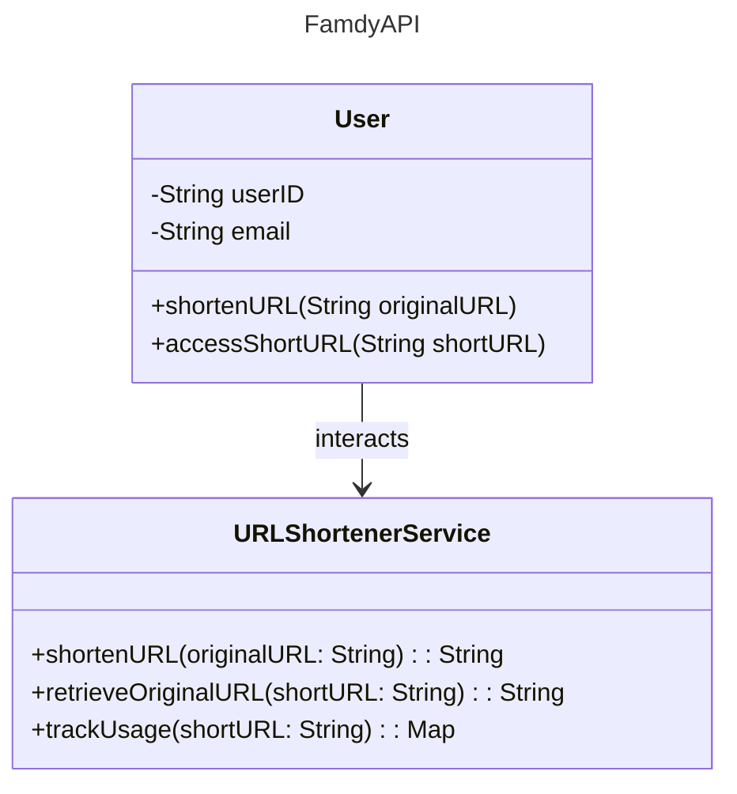

```mermaid
---
title: FamdyAPI
---
classDiagram
    class User {
        -String userID
        -String email
        +shortenURL(String originalURL)
        +accessShortURL(String shortURL)
    }

    class URLShortenerService {
        +shortenURL(originalURL: String): String
        +retrieveOriginalURL(shortURL: String): String
        +trackUsage(shortURL: String): Map
    }
    User --> URLShortenerService : interacts

```
